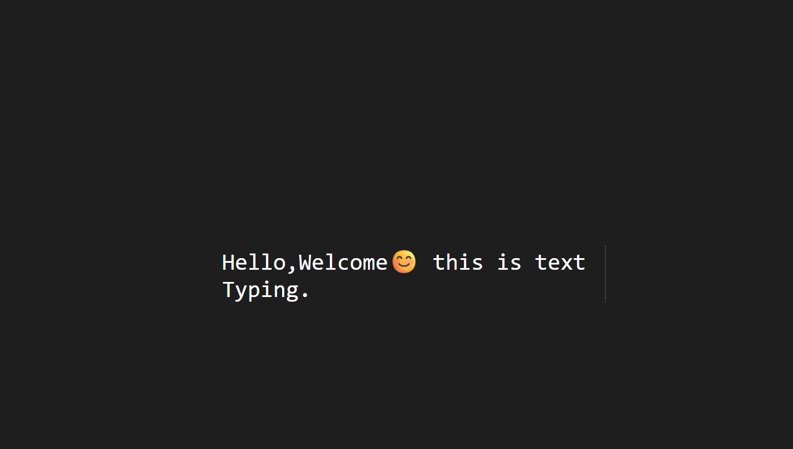

# ⌨️ Pure CSS Typing Text Effect

This project showcases a **typewriter-style typing effect** created using only **HTML and CSS** — no JavaScript required! It features smooth text reveal and a blinking cursor using modern CSS animations.

Perfect for headers, intros, or landing pages.

---

## ✨ Features

- 🧵 Typing animation using `@keyframes` and `steps()`
- 💡 Blinking cursor created with `border-right` and animation
- 🎨 Clean, minimal design with monospace font
- 📱 Fully centered and responsive layout
- 🔥 No JavaScript at all — pure HTML + CSS

---

## 📸 Preview

 

---

## 🛠 Technologies Used

- HTML5
- CSS3 (Keyframes, Flexbox, Units like `ch`)

---

## 🧪 How It Works

- The text is inside a `<div>` with a fixed `width: 0` at the start
- A `typing` animation increases the width from `0` to `Nch`
- The `steps()` function makes it look like it's typing one character at a time
- A `blink` animation makes the right border flash like a cursor
- All done with only CSS — no JS!

---

## 🚀 How to Use

1. Clone the repository:

   ```bash
   git clone https://github.com/kalsol17/Typing-Text-Effect-.git
